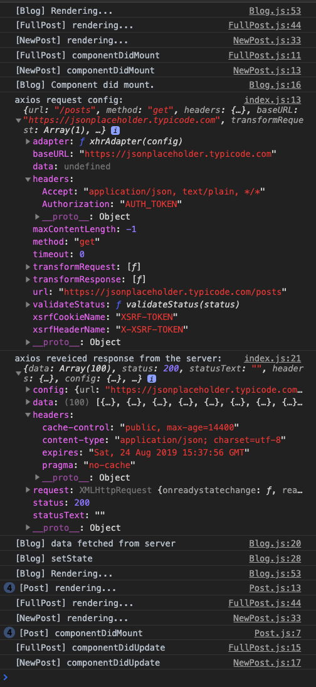
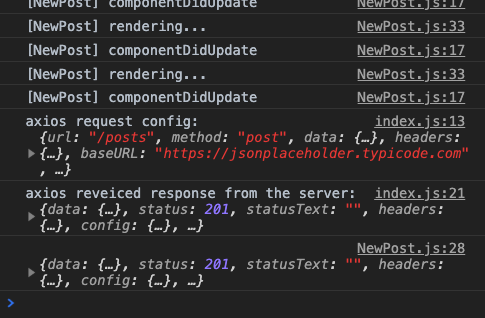
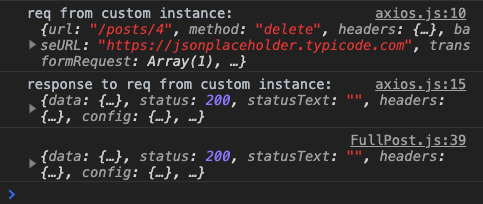

# React AJAX with axios.js
From Maximilian Schwarzmüller's Udemy Course: **React - The complete guide**  

## Console logs  
  
### `npm start`



### On clicking one of the post


### On clicking "Add Post"
```
[NewPost] rendering...
[NewPost] componentDidUpdate
```
(for every word typed into input control)




### On clicking "Delete" on `<FullPost />`



### `https://jsonplaceholder.typicode.com/posts/`
```json
[
  {
    "userId": 1,
    "id": 1,
    "title": "sunt aut facere repellat provident occaecati excepturi optio reprehenderit",
    "body": "quia et suscipit\nsuscipit recusandae consequuntur expedita et cum\nreprehenderit molestiae ut ut quas totam\nnostrum rerum est autem sunt rem eveniet architecto"
  },
  {
    "userId": 1,
    "id": 2,
    "title": "qui est esse",
    "body": "est rerum tempore vitae\nsequi sint nihil reprehenderit dolor beatae ea dolores neque\nfugiat blanditiis voluptate porro vel nihil molestiae ut reiciendis\nqui aperiam non debitis possimus qui neque nisi nulla"
  },
  {
    "userId": 1,
    "id": 3,
    "title": "ea molestias quasi exercitationem repellat qui ipsa sit aut",
    "body": "et iusto sed quo iure\nvoluptatem occaecati omnis eligendi aut ad\nvoluptatem doloribus vel accusantium quis pariatur\nmolestiae porro eius odio et labore et velit aut"
  },
  ...